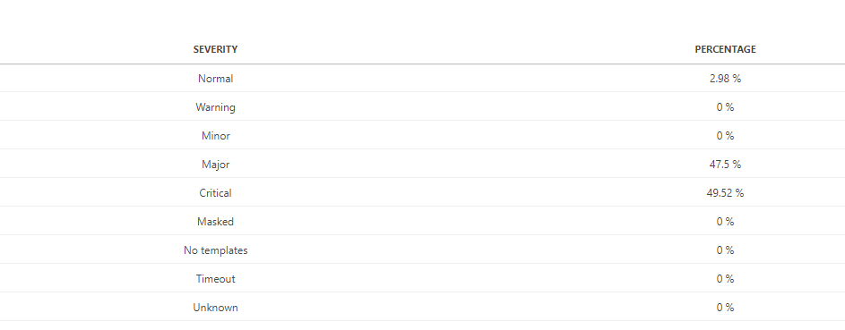
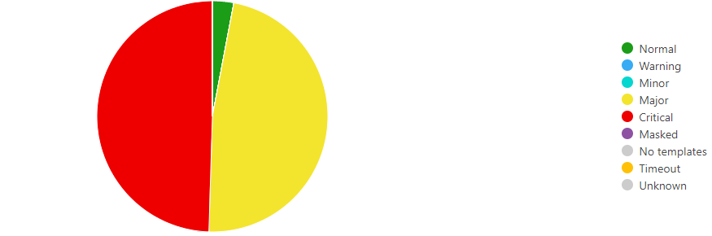
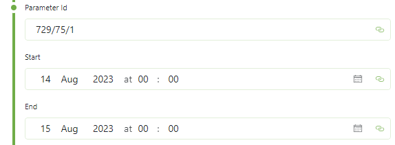

# SLC-GQIDS-ParameterAlarmPercentages

Retrieves the severity-wise percentages within a specified time period.

This result in a table with 2 columns:

- Severity
  - A string column identifying the severity of the value.
- Percentage
  - A double column identifying the percentage of time this parameter was in the state of this severity.

This can also be displayed in any other GQI visualization. A pie chart for this data is most suitable. Note that the colors of the pie chart need to be configured manually. These colors are mapped based on the row order.

## Arguments

This data sources comes with 3 arguments:

- Parameter Id
  - In the format "A/B/C" where
    - A is the DataMiner I
    - B is the element Id
    - C is the parameter Id
- Start of the time window
- End of the time window

