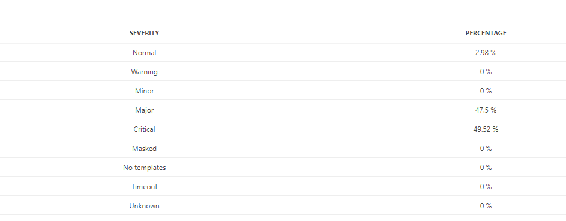
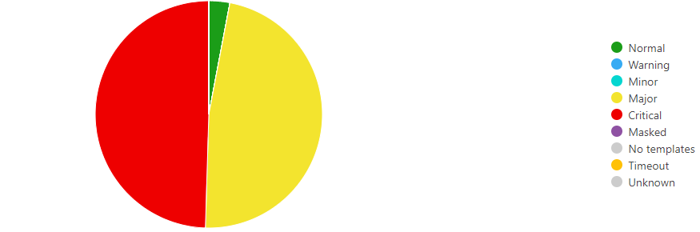
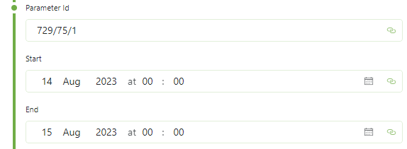

# About

The Parameter Alarm Percentages data source retrieves the severity-wise percentages of a parameter within a specified time period.

This results in a table with 2 columns:

- **Severity**: A string column identifying the severity of the value.
- **Percentage**: A double column identifying the percentage of time this parameter was in the state of this severity.

The data can be visualized in any GQI visualization. A pie chart is most suitable for this data.

> **Note**: When using a pie chart, the colors need to be configured manually. These colors are mapped based on the row order.

# Key Features

- Shows the percentage of time a parameter spent in each alarm severity
- Can be used for any standalone parameter

# Use Cases

## Monitoring Parameter Alarm Distribution

Visualize the distribution of alarm severities for a specific parameter over a given time window to identify patterns and trends in alarm behavior.

## Time-based Alarm Analysis

Analyze how much time a parameter spends in different severity states (Normal, Warning, Minor, Major, Critical) to assess system health and performance.

# Arguments

This data source requires 3 arguments:

- **Parameter Id**
  - Format: "A/B/C" where:
    - A is the DataMiner Id
    - B is the Element Id
    - C is the Parameter Id
- **Start of the time window**
  - The beginning timestamp for the analysis period
- **End of the time window**
  - The ending timestamp for the analysis period

